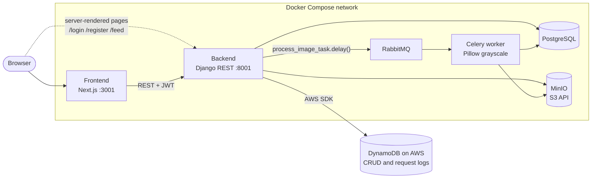

# Photo Feed, Self-Hosted

An Instagram-style photo feed (called Nuvem in the UI): users sign up, post pictures with a caption, and a background job produces a black-and-white copy of each image.

This is the self-hosted counterpart of the [`photo-feed-aws`](https://github.com/matheustguimaraes/photo-feed-aws) repository, where the same app runs on managed AWS services. Here each managed service is replaced with a container: S3 becomes MinIO, SNS/SQS and Lambda become RabbitMQ and a Celery worker, and RDS becomes a Postgres container. DynamoDB stays on AWS for logs. The whole stack starts with one `docker compose up`, and Terraform provisions a single EC2 host to run it online. Having both versions side by side makes the trade-off concrete: less to operate with the managed services, a lower bill and no lock-in with the containers.

## Architecture



Upload flow:

1. The frontend creates the post and uploads the image to `POST /posts/{id}/upload-image/`.
2. The backend stores the file in the private area of the MinIO bucket, removes the post's previous images, saves the new key and queues a Celery task through RabbitMQ.
3. The Celery worker reads the original from MinIO, converts it to grayscale with Pillow, stores `<name>_bw.<ext>` in MinIO and updates the post in Postgres.
4. Every create, read, update and delete, plus every authenticated request, is written to DynamoDB. The `/logs` page in the frontend reads them back with filters by action and model.

## Stack

| Layer | Technology |
| --- | --- |
| Frontend | Next.js 16 (App Router), React 19, TypeScript, Tailwind CSS 4, TanStack Query |
| Backend | Django 5.2, Django REST Framework, SimpleJWT, drf-yasg (Swagger) |
| Relational database | PostgreSQL 14 (container) |
| File storage | MinIO through django-storages' S3 backend |
| Messaging and jobs | RabbitMQ + Celery 5 (results stored with django-celery-results) |
| Logs | Amazon DynamoDB |
| Infrastructure | Docker Compose; Terraform for the EC2 host, DynamoDB table and IAM role |

## Repository layout

```text
backend/              Django API, Celery app (django_app/celery_nuvem.py) and tasks (posts_api/tasks.py)
backend/docker/       Dockerfile for the Celery worker image
frontend/             Next.js app (feed, post pages, profile, logs, login/register)
terraform/            VPC, public subnet, EC2 with Docker, Elastic IP, DynamoDB table, IAM
docker-compose.yaml   Full stack: postgres, rabbitmq, minio, bucket setup, backend, celery, frontend
```

## Running locally

Requirements: Docker and Docker Compose. DynamoDB needs AWS credentials; without them the app still works and the log writes fail silently.

```bash
cp backend/.env.docker.example backend/.env.docker
cp frontend/.env.docker.example frontend/.env.docker

docker compose up --build
```

| Service | URL |
| --- | --- |
| Frontend | <http://localhost:3001> |
| API | <http://localhost:8001> |
| Swagger | <http://localhost:8001/swagger/> |
| MinIO console | <http://localhost:9901> (minio / minio123) |
| RabbitMQ management | <http://localhost:15673> (admin / admin) |

The `createbuckets` container creates the MinIO buckets and makes them public on startup.

To run only the infrastructure and keep Django and Next.js on the host:

```bash
docker compose up rabbitmq postgres minio createbuckets -d

cd backend
python -m venv venv && source venv/bin/activate
pip install -r requirements.txt
python manage.py migrate
python manage.py runserver
python -m celery -A django_app.celery_nuvem:app worker -E -l INFO   # in another terminal

cd ../frontend
npm install
npm run dev
```

## Deploying on EC2

`terraform/` creates a VPC with one public subnet, a `t2.micro` instance with Docker and Docker Compose installed, an Elastic IP, the DynamoDB table and an instance role that can write to it.

```bash
cd terraform
terraform init
terraform apply -var="key_pair_name=<your key pair>"
terraform output ssh_command
```

Then copy the repository to `/home/ec2-user/app` on the instance and run `docker compose up -d` there.

## API

| Method | Route | Description |
| --- | --- | --- |
| POST | `/auth/register/` | Create a user and an empty profile |
| POST | `/auth/token/` | Get an access and refresh token |
| POST | `/auth/token/refresh/` | Refresh the access token |
| GET, PATCH | `/auth/profile/` | Read or update the profile (age, course, city) |
| GET, POST | `/posts/` | List the user's posts or create one |
| GET, PATCH, DELETE | `/posts/{id}/` | Read, edit or delete a post (delete also removes the files) |
| POST | `/posts/{id}/upload-image/` | Upload the image and queue processing |
| GET | `/logs/?action_type=&model_name=&limit=` | Read the DynamoDB logs |

## Trade-offs

Things I left simple on purpose to keep the scope small:

- CSRF middleware is off and CORS allows any origin, since the API only takes JWTs.
- MinIO buckets are public and URLs are served over plain HTTP.
- The Django dev server runs in the container instead of Gunicorn.
- The DynamoDB log view uses a table scan, which is fine for a demo and not for real traffic.
